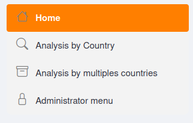
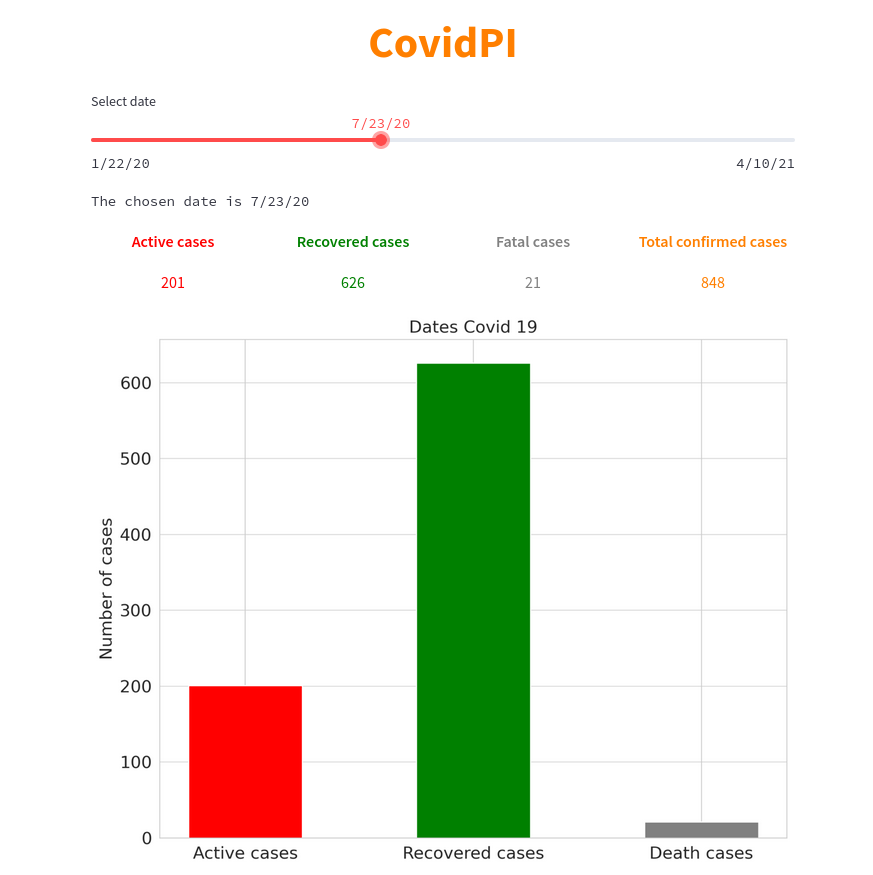
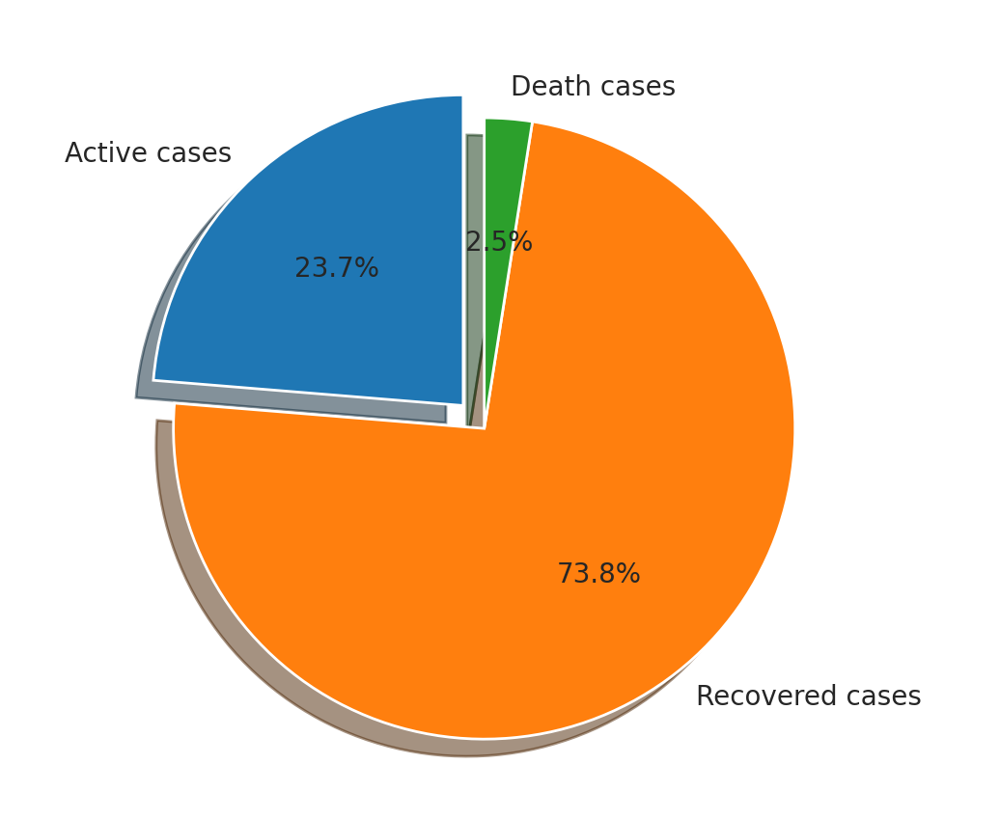
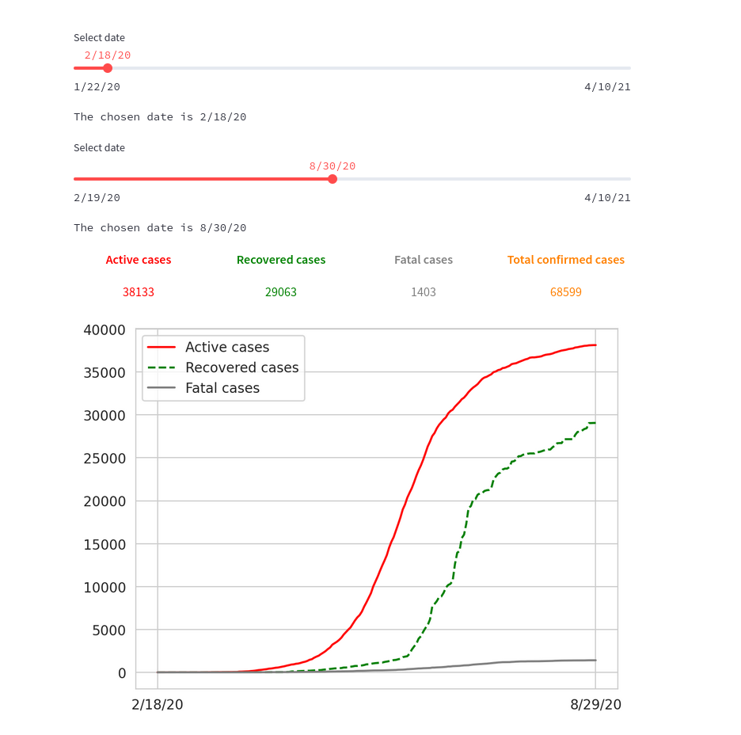
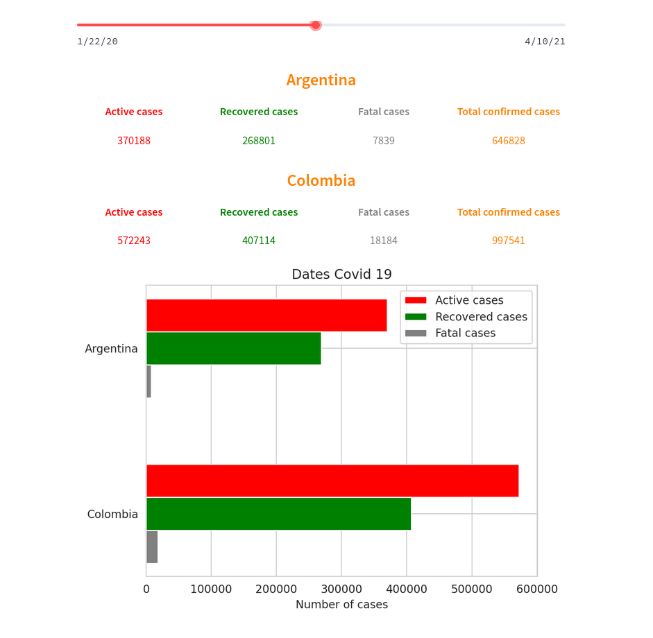
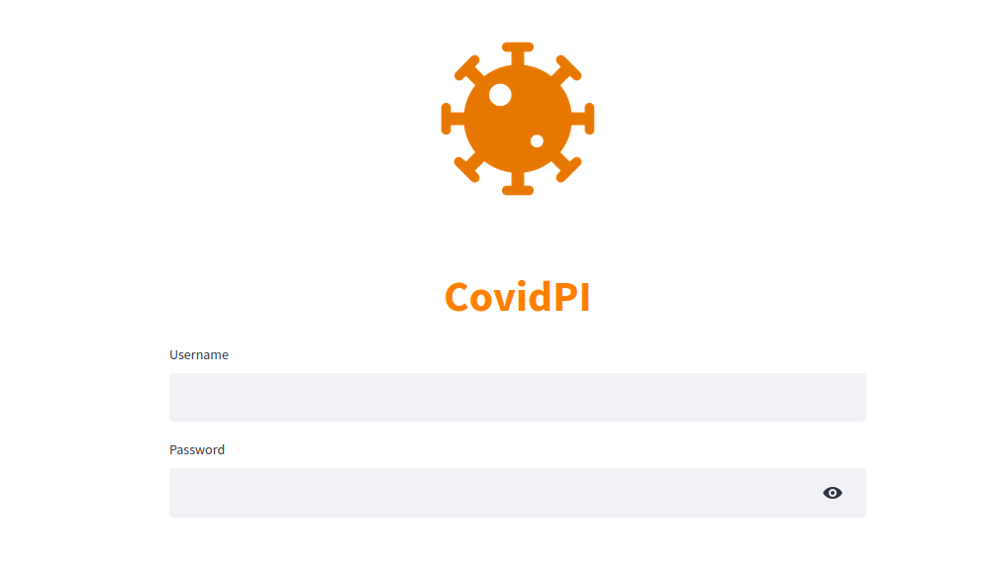
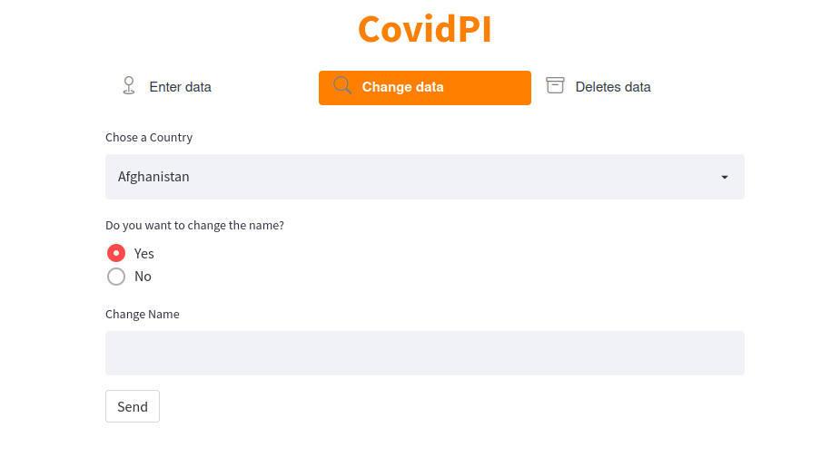

 <center>
	  
</center>

<h1 style='text-align: center; color:#FF7F00 ;'>CovidPI</h1>

The CovidPi API will show you different interactive maps and graphs depicting the geographical spread of the virus around the world.

---

<h2 style='text-align: center; color:#FF7F00 ;'>Contents of this file</h2>

- Introduction
- Requeriments
- Instructions
- API Reference


---

<h2 style='text-align: center; color:#FF7F00 ;'>Introduction</h2>

The following API is responsible for analyzing data from different countries of the world, during the years 2021 and 2020, in it you can find, for the realization of the API have been used three different databases:

- confirmed_global
- deaths_global
- recovered_global

The database was obtained from the following link:

- [Data Covid-19 Global](https://www.kaggle.com/datasets/baguspurnama/covid-confirmed-global)

---
<h2 style='text-align: center; color:#FF7F00 ;'>Requeriments</h2>

You need to have all the libraries from the requirements.txt file installed. Once everything is installed, you can start running the covid dashboad.

To start, go to the Dashboard folder from the console and run the following command:

```
streamlit run streamlit.py
```
To be able to use the administrator section from the Dashboard it is necessary to include a file with the users that are going to have these permissions, this file will be placed inside the .streamlit folder with the name secrets.toml and will have the following format:

```
#.streamlit/secrets.toml

[passwords]
# Follow the rule: username = "password"
username = "password"
```
---

<h2 style='text-align: center; color:#FF7F00 ;'>Instructions</h2>


On the dashboard you can find an interactive menu located in the sidebar, with four different sections:

<center>
	  
</center>

In the country analysis section, we can find different ways to receive the data:

- For day
- Acumulates
- Date range

In the subsection for a day we will be able to observe the data of the dead, recovered and active per day. In addition we can choose two different types of graphs to reflect the data.

<center>
	  
</center>

---

<center>
	  
</center>

The accumulated subsection shows the accumulated data from the beginning of the pandemic until the selected date.

In the last subsection, we can choose the accumulated data we want in a specific time range and receive a graph where we can observe the growth of the cases, etc.

<center>
	  
</center>

In the country analysis section, we can choose to compare the data between countries and display the data and a comparative graph.

<center>
	  
</center>

Finally we can find an administrator menu where we can add, modify and delete data from the API and that are modified directly in the database.

<center>
	  
</center>

---

<center>
	  
</center>

---

<h2 style='text-align: center; color:#FF7F00 ;'>API Reference</h2>

#### Get all countries

```http
  GET /api/countries
```

| Parameter | Type     | Description                |
| :-------- | :------- | :------------------------- |
| `api_key` | `list` | **Required**. Your API key |

#### Get coord

```http
  GET /api/coord/{country}
```

| Parameter | Type     | Description                       |
| :-------- | :------- | :-------------------------------- |
| `country`      | `string` | **Required**. name of country |

#### Get all dates

```http
  GET /api/all/dates
```

| Parameter | Type     | Description                       |
| :-------- | :------- | :-------------------------------- |
| `api_key`      | `list` | **Required**. Your API key |

#### Get confirmed range

```http
  GET /api/confirmed/dates/{country}/{start}/{end}
```

| Parameter | Type     | Description                       |
| :-------- | :------- | :-------------------------------- |
| `country`, `start`, `end`      | `list` | **Required**. name of country, start date end date |

#### Get confirmed day

```http
  GET /api/confirmed/day/{country}/{start}
```

| Parameter | Type     | Description                       |
| :-------- | :------- | :-------------------------------- |
| `country`, `start`      | `int` | **Required**. name of country, start date|

#### Get confirmed data acumulated

```http
  GET /api/confirmed/{country}/{date}
```

| Parameter | Type     | Description                       |
| :-------- | :------- | :-------------------------------- |
| `country`, `date`     | `int` | **Required**. name of country, date|

#### Get Get death range

```http
  GET /api/death/dates/{country}/{start}/{end}
```

| Parameter | Type     | Description                       |
| :-------- | :------- | :-------------------------------- |
| `country`, `start`, `end`       | `list` | **Required**. name of country, date|

#### Get confirmed day

```http
  GET /api/death/day/{country}/{start}
```

| Parameter | Type     | Description                       |
| :-------- | :------- | :-------------------------------- |
| `country`, `start`       | `int` | **Required**. name of country, start date|

#### Get death data acumulated

```http
  GET /api/death/{country}/{date}
```

| Parameter | Type     | Description                       |
| :-------- | :------- | :-------------------------------- |
| `country`, `date`       | `int` | **Required**. name of country, date|

#### Get Get recovered range

```http
  GET /api/recovered/dates/{country}/{start}/{end}
```

| Parameter | Type     | Description                       |
| :-------- | :------- | :-------------------------------- |
| `country`, `start`, `end`        | `list` | **Required**. name of country, date|

#### Get recovered day

```http
  GET /api/recovered/day/{country}/{start}
```

| Parameter | Type     | Description                       |
| :-------- | :------- | :-------------------------------- |
| `country`, `start`     | `int` | **Required**. name of country, start date|

#### Get recovered data acumulated

```http
  GET /api/recovered/{country}/{date}
```

| Parameter | Type     | Description                       |
| :-------- | :------- | :-------------------------------- |
| `country`, `date`      | `int` | **Required**. name of country, date|

#### Post country

```http
  POST /api/add/country
```

| Parameter | Type     | Description                       |
| :-------- | :------- | :-------------------------------- |
| `api_key`      | `str` | **Required**. Your API key|

#### Put name country

```http
  PUT /api/name/country/{name}
```

| Parameter | Type     | Description                       |
| :-------- | :------- | :-------------------------------- |
| `name`      | `str` | **Required**. Name country|

#### Put date confirmed

```http
  PUT /api/confirm/data/{name}/{date}
```

| Parameter | Type     | Description                       |
| :-------- | :------- | :-------------------------------- |
| `name`,`date`      | `str` | **Required**. Name country, date|

#### Put recover confirmed

```http
  PUT /api/recover/data/{name}/{date}}
```

| Parameter | Type     | Description                       |
| :-------- | :------- | :-------------------------------- |
| `name`,`date`      | `str` | **Required**. Name country, date|

#### Put death confirmed

```http
  PUT /api/fatal/data/{name}/{date}
```

| Parameter | Type     | Description                       |
| :-------- | :------- | :-------------------------------- |
| `name`,`date`      | `str` | **Required**. Name country, date|

#### Delete country

```http
  DELETE /api/delete/country"}
```

| Parameter | Type     | Description                       |
| :-------- | :------- | :-------------------------------- |
| `api_key`       | `str` | **Required**. Your API key|


